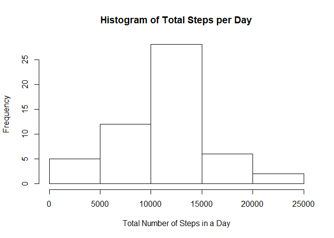
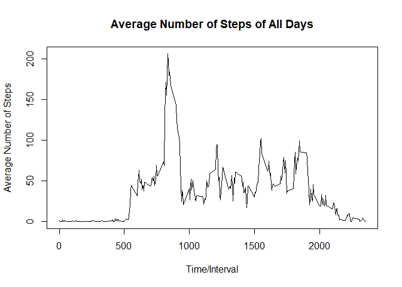
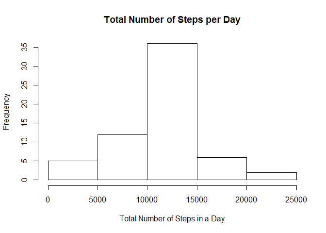
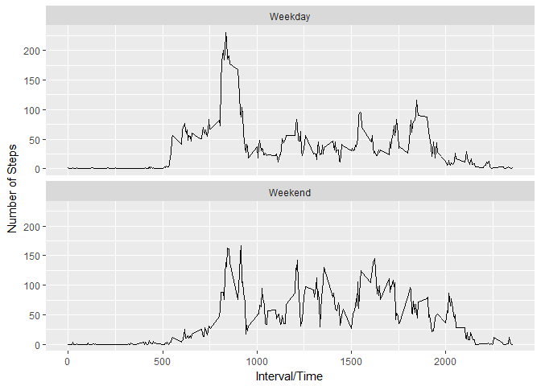

PA1\_template.Rmd
================
Jenni Bochenek
December 4, 2017

Packages needed for this to run.

``` r
install.packages("rmarkdown", repos = "http://cran.us.r-project.org")
library(rmarkdown)
install.packages("dplyr",repos = "http://cran.us.r-project.org") 
library(dplyr)
install.packages("ggplot2",repos = "http://cran.us.r-project.org") 
library(ggplot2)
```

Loading and preprocessing the data
----------------------------------

### \*Load the data (i.e. read.csv()) Read in the data to the environment. Data must be in the working directory.

``` r
act <- read.csv("./activity.csv",header=TRUE, sep = ",", na.strings = "NA", comment.char = "")
```

### \*Process/transform the data (if necessary) into a format suitable for your analysis Pre-emptively make a version without the N/A rows

``` r
act.na <- act[ with (act, { !(is.na(steps)) } ), ]
```

1. What is mean total number of steps taken per day?
----------------------------------------------------

### \*Calculate the total number of steps taken per day Using dplyr, group each date entry into days, then sum up the number of steps per day into daily.steps.

``` r
daily <- group_by(act.na, date)
act.daily <- summarize(daily, daily.steps = sum(steps))
```

### \*Make a histogram of the total number of steps taken each day Made a histogram of the total number of steps per day. I considered putting it in ggplot to make it prettier...

``` r
hist(act.daily$daily.steps, main="Histogram of Total Steps per Day", xlab="Total Number of Steps in a Day")
```

 \#\#\#\*Calculate and report the mean and median of the total number of steps taken per day

``` r
mean.act.daily <- mean(act.daily$daily.steps)
median.act.daily <- median(act.daily$daily.steps)
```

The mean number of daily steps are 1.076618910^{4}

The median number of daily steps is 10765

2. What is the average daily activity pattern?
----------------------------------------------

### \*Make a time series plot (i.e. type = "l") of the 5-minute interval (x-axis) and the average number of steps taken, averaged across all days (y-axis)

``` r
interval.act.daily <- aggregate(steps ~ interval, act.na, mean)
plot(interval.act.daily$interval, interval.act.daily$steps, type="l", main="Average Number of Steps of All Days", xlab ="Time/Interval", ylab="Average Number of Steps")
```



### \*Which 5-minute interval, on average across all the days in the dataset, contains the maximum number of steps?

``` r
interval.steps <- which.max(interval.act.daily$steps)
interval.act.daily[interval.steps, ]
```

    ##     interval    steps
    ## 104      835 206.1698

3. Imputing missing values
--------------------------

### \*Calculate and report the total number of missing values in the dataset (i.e. the total number of rows with

``` r
na.act <- act[!complete.cases(act), ]
nrow(na.act)
```

    ## [1] 2304

There are 2304 rows with N/A

### \*Devise a strategy for filling in all of the missing values in the dataset. This will fill with the appropriate means from a similar interval time, rather than the mean of the daily activity. Both are valid methods when dealing with missing values.

### \*Create a new dataset that is equal to the original dataset but with the missing data filled in.

``` r
no.na.act <- act
for (i in 1:length(no.na.act$steps)){
        if (is.na(no.na.act$steps[i] == TRUE)){        
        no.na.act$steps[i] <- interval.act.daily$steps[match(no.na.act$interval[i], interval.act.daily$interval)]  
        } 
}
```

### \*Make a histogram of the total number of steps taken each day and calculate and report the mean and median total number of steps taken per day. Do these values differ from the estimates from the first part of the assignment? What is the impact of imputing missing data on the estimates of the total daily number of steps?

``` r
no.na.act.daily <- aggregate(steps ~ date, no.na.act, sum)
hist(no.na.act.daily$steps, main="Total Number of Steps per Day", xlab="Total Number of Steps in a Day")
```



``` r
mean.no.na.act.daily <- mean(no.na.act.daily$steps)
median.no.na.act.daily <- median(no.na.act.daily$steps)
```

The mean number of daily steps with N/A values filled is 1.076618910^{4}

The median number of daily steps with N/A values filled is 1.076618910^{4}

Compare to the previous values before we filled in the N/A values

The mean number of daily steps are 1.076618910^{4}

The median number of daily steps is 10765

The distribution has become more normal with the N/As filled in as the median = the mean. Whereas the previous results was skewed as the median =/= the mean.

4. Are there differences in activity patterns between weekdays and weekends?
----------------------------------------------------------------------------

### \*Create a new factor variable in the dataset with two levels - "weekday" and "weekend" indicating whether a given date is a weekday or weekend day.

``` r
no.na.act['weekday'] <- weekdays(as.Date(no.na.act$date))
no.na.act$weekday[no.na.act$weekday %in% c('Saturday','Sunday')] <- "Weekend"
no.na.act$weekday[no.na.act$weekday !="Weekend"] <- "Weekday"
no.na.act$weekday <- as.factor(no.na.act$weekday)
no.na.act.week <- aggregate(steps ~ interval + weekday,no.na.act, mean)
```

### \*Make a panel plot containing a time series plot (i.e. type = "l") of the 5-minute interval (x-axis) and the average number of steps taken, averaged across all weekday days or weekend days (y-axis). See the README file in the GitHub repository to see an example of what this plot should look like using simulated data.

``` r
ggplot(no.na.act.week, aes(interval,steps)) + geom_line()+ labs(x="Interval/Time", y="Number of Steps") +
    facet_wrap(~ weekday, nrow =2)
```


